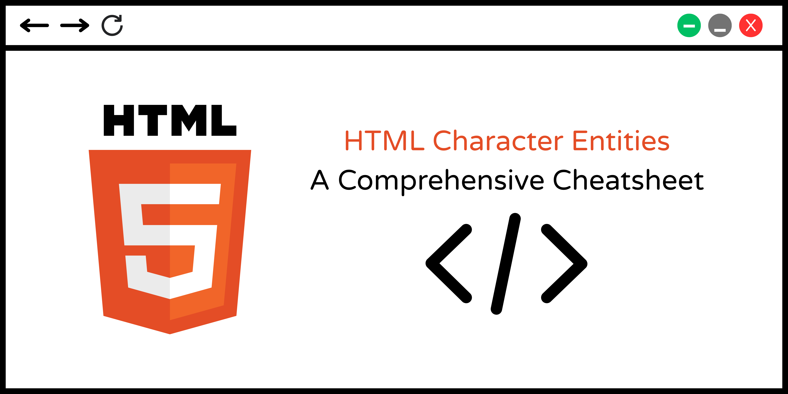

  
   

  <h1 align="right">HTML Character Entities Cheat Sheet</h1>

  <picture>
    <source media="(prefers-color-scheme: dark)" srcset="assets/banner-dark-mode.png" alt="Repository banner dark color scheme" />
    <source media="(prefers-color-scheme: light)" srcset="assets/banner-light-mode.png" alt="Repository banner light color scheme" />
    
  </picture>

## 📑 About

**Character entities** allow you to display special characters and symbols within **HTML** documents that are not available in the **charset** encoding. These special characters must be replaced with **character entities** to prevent the browser from interpreting them as HTML code or rendering them incorrectly.

This comprehensive cheat sheet provides a quick reference to help you navigate this sea of characters, glyphs, and symbols. We'll be covering their usage, types, and best practices for creating well-formatted and accessible content.

🫶 **Contributions are welcome!** Feel free to:

- Correct grammatical errors and improve readability.
- Add new characters, glyphs, and symbols.
- Translate this project into your language.
- Improve explanations and address other issues.

---

## 📋 Table of Contents

- [📑 About](#-about)
- [📎 Types of character entities](#-types-of-character-entities)
- [📓 Best practices and recommendations](#-best-practices-and-recommendations)
- [📜 List of HTML character entities](#-list-of-html-character-entities)
- [🌎 Localization](#-localization)
- [🤝 Contributing](#-contributing)
- [📄 Licenses and copyright](#-licenses-and-copyright)

---

## 📎 Types of Character Entities

HTML character entities are codes used to display reserved characters or special symbols—such as accented letters, diacritical marks, emojis, and characters not found on a standard keyboard without interfering with HTML parsing.

There are three ways to represent them:

1. **Named Entities:** Represented by a standard and unique human-readable name, such as `&copy;` for the copyright symbol (&copy;) and `&gt;` for the greater-than sign (&gt;).
2. **Decimal Codes:** Represented by the character's Unicode decimal value preceded by `&#`, such as `&#169;` for the copyright symbol (&#169;) and `&#120506;` for the mathematical character sigma (&#120506;).
3. **Hexadecimal Codes:** Represented by the character's Unicode hexadecimal value preceded by `&#x`, such as `&#x00A9;` for the copyright symbol (&#x00A9;) and `&#x03A9;` for the Greek letter omega (&#x03A9;).

> [!TIP]
> Both decimal and hexadecimal formats are collectively known as **Numeric Entities**.

---

## 📓 Best Practices and Recommendations

- **Prefer Named Entities When Possible:** Use named entities for commonly used characters to enhance code readability. Named entities are easier to remember than numeric entities, making them simpler to read and maintain.

> [!NOTE]
> Entity names are case-sensitive. Always write entity names in lowercase.

- **Use Numeric Entities for Less Common Characters:** Many characters like `U+2691` (⚑) do not have a named equivalent. In these cases, use decimal or hexadecimal codes instead.

- **Prioritize Accessibility:** Ensure character entities remain accessible to screen readers and other assistive technologies by providing alternative text or context when necessary.

> [!TIP]
> Always specify UTF-8 character encoding (`<meta charset="UTF-8">`) at the beginning of every HTML document. UTF-8 natively supports almost all characters, ensuring browsers display content correctly and eliminating the need for character entities in most scenarios.

> [!WARNING]
> Web browsers can only render a character if the user's device has a font installed that supports it. If a character is missing from the available fonts, it will usually display as a box or placeholder symbol.

---

## 📜 List of HTML Character Entities

| Character | Description | Named Entity | Decimal Code | Hexadecimal Code |
| :---: | --- | :---: | :---: | :---: |
| " | Quotation mark | `&quot;` | `&#34;` | `&#x0022;` |
| `&` | Ampersand | `&amp;` | `&#38;` | `&#x0026;` |
| `'` | Apostrophe | `&apos;` | `&#39;` | `&#x0027;` |
| `<` | Less-than sign | `&lt;` | `&#60;` | `&#x003C;` |
| `>` | Greater-than sign | `&gt;` | `&#62;` | `&#x003E;` |
| ` ` | Non-breaking space | `&nbsp;` | `&#160;` | `&#x00A0;` |
| `¡` | Inverted exclamation mark | `&iexcl;` | `&#161;` | `&#x00A1;` |
| `¢` | Cent sign | `&cent;` | `&#162;` | `&#x00A2;` |
| `£` | Pound sign | `&pound;` | `&#163;` | `&#x00A3;` |
| `¤` | Currency sign | `&curren;` | `&#164;` | `&#x00A4;` |
| `¥` | Yen sign | `&yen;` | `&#165;` | `&#x00A5;` |
| `¦` | Broken bar | `&brvbar;` | `&#166;` | `&#x00A6;` |
| `§` | Section sign | `&sect;` | `&#167;` | `&#x00A7;` |
| `¨` | Diaeresis | `&uml;` | `&#168;` | `&#x00A8;` |
| `©` | Copyright symbol | `&copy;` | `&#169;` | `&#x00A9;` |
| `ª` | Feminine ordinal indicator | `&ordf;` | `&#170;` | `&#x00AA;` |
| `«` | Left-pointing double angle quotation mark | `&laquo;` | `&#171;` | `&#x00AB;` |
| `¬` | Not sign | `&not;` | `&#172;` | `&#x00AC;` |
| `­` | Soft hyphen | `&shy;` | `&#173;` | `&#x00AD;` |
| `®` | Registered sign | `&reg;` | `&#174;` | `&#x00AE;` |
| `¯` | Macron | `&macr;` | `&#175;` | `&#x00AF;` |
| `°` | Degree symbol | `&deg;` | `&#176;` | `&#x00B0;` |
| `±` | Plus-minus sign | `&plusmn;` | `&#177;` | `&#x00B1;` |
| `²` | Superscript two | `&sup2;` | `&#178;` | `&#x00B2;` |
| `³` | Superscript three | `&sup3;` | `&#179;` | `&#x00B3;` |
| `´` | Acute accent | `&acute;` | `&#180;` | `&#x00B4;` |
| `µ` | Micro sign | `&micro;` | `&#181;` | `&#x00B5;` |
| `¶` | Pilcrow sign | `&para;` | `&#182;` | `&#x00B6;` |
| `·` | Middle dot | `&middot;` | `&#183;` | `&#x00B7;` |
| `¸` | Cedilla | `&cedil;` | `&#184;` | `&#x00B8;` |
| `¹` | Superscript one | `&sup1;` | `&#185;` | `&#x00B9;` |
| `º` | Masculine ordinal indicator | `&ordm;` | `&#186;` | `&#x00BA;` |
| `»` | Right-pointing double angle quotation mark | `&raquo;` | `&#187;` | `&#x00BB;` |
| `¼` | Vulgar fraction one quarter | `&frac14;` | `&#188;` | `&#x00BC;` |
| `½` | Vulgar fraction one half | `&frac12;` | `&#189;` | `&#x00BD;` |
| `¾` | Vulgar fraction three quarters | `&frac34;` | `&#190;` | `&#x00BE;` |
| `¿` | Inverted question mark | `&iquest;` | `&#191;` | `&#x00BF;` |
| `À` | Latin capital letter A with grave | `&Agrave;` | `&#192;` | `&#x00C0;` |
| `Á` | Latin capital letter A with acute | `&Aacute;` | `&#193;` | `&#x00C1;` |
| `Â` | Latin capital letter A with circumflex | `&Acirc;` | `&#194;` | `&#x00C2;` |
| `Ã` | Latin capital letter A with tilde | `&Atilde;` | `&#195;` | `&#x00C3;` |
| `Ä` | Latin capital letter A with diaeresis | `&Auml;` | `&#196;` | `&#x00C4;` |
| `Å` | Latin capital letter A with ring above | `&Aring;` | `&#197;` | `&#x00C5;` |
| `Æ` | Latin capital letter AE | `&AElig;` | `&#198;` | `&#x00C6;` |
| `Ç` | Latin capital letter C with cedilla | `&Ccedil;` | `&#199;` | `&#x00C7;` |
| `È` | Latin capital letter E with grave | `&Egrave;` | `&#200;` | `&#x00C8;` |
| `É` | Latin capital letter E with acute | `&Eacute;` | `&#201;` | `&#x00C9;` |
| `Ê` | Latin capital letter E with circumflex | `&Ecirc;` | `&#202;` | `&#x00CA;` |
| `Ë` | Latin capital letter E with diaeresis | `&Euml;` | `&#203;` | `&#x00CB;` |
| `Ì` | Latin capital letter I with grave | `&Igrave;` | `&#204;` | `&#x00CC;` |
| `Í` | Latin capital letter I with acute | `&Iacute;` | `&#205;` | `&#x00CD;` |
| `Î` | Latin capital letter I with circumflex | `&Icirc;` | `&#206;` | `&#x00CE;` |
| `Ï` | Latin capital letter I with diaeresis | `&Iuml;` | `&#207;` | `&#x00CF;` |
| `Ð` | Latin capital letter Eth | `&ETH;` | `&#208;` | `&#x00D0;` |
| `Ñ` | Latin capital letter N with tilde | `&Ntilde;` | `&#209;` | `&#x00D1;` |
| `Ò` | Latin capital letter O with grave | `&Ograve;` | `&#210;` | `&#x00D2;` |
| `Ó` | Latin capital letter O with acute | `&Oacute;` | `&#211;` | `&#x00D3;` |
| `Ô` | Latin capital letter O with circumflex | `&Ocirc;` | `&#212;` | `&#x00D4;` |
| `Õ` | Latin capital letter O with tilde | `&Otilde;` | `&#213;` | `&#x00D5;` |
| `Ö` | Latin capital letter O with diaeresis | `&Ouml;` | `&#214;` | `&#x00D6;` |
| `×` | Multiplication sign | `&times;` | `&#215;` | `&#x00D7;` |
| `Ø` | Latin capital letter O with stroke | `&Oslash;` | `&#216;` | `&#x00D8;` |
| `Ù` | Latin capital letter U with grave | `&Ugrave;` | `&#217;` | `&#x00D9;` |
| `Ú` | Latin capital letter U with acute | `&Uacute;` | `&#218;` | `&#x00DA;` |
| `Û` | Latin capital letter U with circumflex | `&Ucirc;` | `&#219;` | `&#x00DB;` |
| `Ü` | Latin capital letter U with diaeresis | `&Uuml;` | `&#220;` | `&#x00DC;` |
| `Ý` | Latin capital letter Y with acute | `&Yacute;` | `&#221;` | `&#x00DD;` |
| `Þ` | Latin capital letter Thorn | `&THORN;` | `&#222;` | `&#x00DE;` |
| `ß` | Latin small letter sharp s | `&szlig;` | `&#223;` | `&#x00DF;` |
| `à` | Latin small letter a with grave | `&agrave;` | `&#224;` | `&#x00E0;` |
| `á` | Latin small letter a with acute | `&aacute;` | `&#225;` | `&#x00E1;` |
| `â` | Latin small letter a with circumflex | `&acirc;` | `&#226;` | `&#x00E2;` |
| `ã` | Latin small letter a with tilde | `&atilde;` | `&#227;` | `&#x00E3;` |
| `ä` | Latin small letter a with diaeresis | `&auml;` | `&#228;` | `&#x00E4;` |
| `å` | Latin small letter a with ring above | `&aring;` | `&#229;` | `&#x00E5;` |
| `æ` | Latin small letter ae | `&aelig;` | `&#230;` | `&#x00E6;` |
| `ç` | Latin small letter c with cedilla | `&ccedil;` | `&#231;` | `&#x00E7;` |
| `è` | Latin small letter e with grave | `&egrave;` | `&#232;` | `&#x00E8;` |
| `é` | Latin small letter e with acute | `&eacute;` | `&#233;` | `&#x00E9;` |
| `ê` | Latin small letter e with circumflex | `&ecirc;` | `&#234;` | `&#x00EA;` |
| `ë` | Latin small letter e with diaeresis | `&euml;` | `&#235;` | `&#x00EB;` |
| `ì` | Latin small letter i with grave | `&igrave;` | `&#236;` | `&#x00EC;` |
| `í` | Latin small letter i with acute | `&iacute;` | `&#237;` | `&#x00ED;` |
| `î` | Latin small letter i with circumflex | `&icirc;` | `&#238;` | `&#x00EE;` |
| `ï` | Latin small letter i with diaeresis | `&iuml;` | `&#239;` | `&#x00EF;` |
| `ð` | Latin small letter eth | `&eth;` | `&#240;` | `&#x00F0;` |
| `ñ` | Latin small letter n with tilde | `&ntilde;` | `&#241;` | `&#x00F1;` |
| `ò` | Latin small letter o with grave | `&ograve;` | `&#242;` | `&#x00F2;` |
| `ó` | Latin small letter o with acute | `&oacute;` | `&#243;` | `&#x00F3;` |
| `ô` | Latin small letter o with circumflex | `&ocirc;` | `&#244;` | `&#x00F4;` |
| `õ` | Latin small letter o with tilde | `&otilde;` | `&#245;` | `&#x00F5;` |
| `ö` | Latin small letter o with diaeresis | `&ouml;` | `&#246;` | `&#x00F6;` |
| `÷` | Division sign | `&divide;` | `&#247;` | `&#x00F7;` |
| `ø` | Latin small letter o with stroke | `&oslash;` | `&#248;` | `&#x00F8;` |
| `ù` | Latin small letter u with grave | `&ugrave;` | `&#249;` | `&#x00F9;` |
| `ú` | Latin small letter u with acute | `&uacute;` | `&#250;` | `&#x00FA;` |
| `û` | Latin small letter u with circumflex | `&ucirc;` | `&#251;` | `&#x00FB;` |
| `ü` | Latin small letter u with diaeresis | `&uuml;` | `&#252;` | `&#x00FC;` |
| `ý` | Latin small letter y with acute | `&yacute;` | `&#253;` | `&#x00FD;` |
| `þ` | Latin small letter thorn | `&thorn;` | `&#254;` | `&#x00FE;` |
| `ÿ` | Latin small letter y with diaeresis | `&yuml;` | `&#255;` | `&#x00FF;` |
| `Œ` | Latin capital ligature OE | `&OElig;` | `&#338;` | `&#x0152;` |
| `œ` | Latin small ligature oe | `&oelig;` | `&#339;` | `&#x0153;` |
| `Š` | Latin capital letter S with caron | `&Scaron;` | `&#352;` | `&#x0160;` |
| `š` | Latin small letter s with caron | `&scaron;` | `&#353;` | `&#x0161;` |
| `Ÿ` | Latin capital letter Y with diaeresis | `&Yuml;` | `&#376;` | `&#x0178;` |
| `ƒ` | Latin small letter f with hook | `&fnof;` | `&#402;` | `&#x0192;` |
| `ˆ` | Modifier letter circumflex accent | `&circ;` | `&#710;` | `&#x02C6;` |
| `˜` | Small tilde | `&tilde;` | `&#732;` | `&#x02DC;` |
| `Α` | Greek capital letter Alpha | `&Alpha;` | `&#913;` | `&#x0391;` |
| `Β` | Greek capital letter Beta | `&Beta;` | `&#914;` | `&#x0392;` |
| `Γ` | Greek capital letter Gamma | `&Gamma;` | `&#915;` | `&#x0393;` |
| `Δ` | Greek capital letter Delta | `&Delta;` | `&#916;` | `&#x0394;` |
| `Ε` | Greek capital letter Epsilon | `&Epsilon;` | `&#917;` | `&#x0395;` |
| `Ζ` | Greek capital letter Zeta | `&Zeta;` | `&#918;` | `&#x0396;` |
| `Η` | Greek capital letter Eta | `&Eta;` | `&#919;` | `&#x0397;` |
| `Θ` | Greek capital letter Theta | `&Theta;` | `&#920;` | `&#x0398;` |
| `Ι` | Greek capital letter Iota | `&Iota;` | `&#921;` | `&#x0399;` |
| `Κ` | Greek capital letter Kappa | `&Kappa;` | `&#922;` | `&#x039A;` |
| `Λ` | Greek capital letter Lambda | `&Lambda;` | `&#923;` | `&#x039B;` |
| `Μ` | Greek capital letter Mu | `&Mu;` | `&#924;` | `&#x039C;` |
| `Ν` | Greek capital letter Nu | `&Nu;` | `&#925;` | `&#x039D;` |
| `Ξ` | Greek capital letter Xi | `&Xi;` | `&#926;` | `&#x039E;` |
| `Ο` | Greek capital letter Omicron | `&Omicron;` | `&#927;` | `&#x039F;` |
| `Π` | Greek capital letter Pi | `&Pi;` | `&#928;` | `&#x03A0;` |
| `Ρ` | Greek capital letter Rho | `&Rho;` | `&#929;` | `&#x03A1;` |
| `Σ` | Greek capital letter Sigma | `&Sigma;` | `&#931;` | `&#x03A3;` |
| `Τ` | Greek capital letter Tau | `&Tau;` | `&#932;` | `&#x03A4;` |
| `Υ` | Greek capital letter Upsilon | `&Upsilon;` | `&#933;` | `&#x03A5;` |
| `Φ` | Greek capital letter Phi | `&Phi;` | `&#934;` | `&#x03A6;` |
| `Χ` | Greek capital letter Chi | `&Chi;` | `&#935;` | `&#x03A7;` |
| `Ψ` | Greek capital letter Psi | `&Psi;` | `&#936;` | `&#x03A8;` |
| `Ω` | Greek capital letter Omega | `&Omega;` | `&#937;` | `&#x03A9;` |
| `α` | Greek small letter alpha | `&alpha;` | `&#945;` | `&#x03B1;` |
| `β` | Greek small letter beta | `&beta;` | `&#946;` | `&#x03B2;` |
| `γ` | Greek small letter gamma | `&gamma;` | `&#947;` | `&#x03B3;` |
| `δ` | Greek small letter delta | `&delta;` | `&#948;` | `&#x03B4;` |
| `ε` | Greek small letter epsilon | `&epsilon;` | `&#949;` | `&#x03B5;` |
| `ζ` | Greek small letter zeta | `&zeta;` | `&#950;` | `&#x03B6;` |
| `η` | Greek small letter eta | `&eta;` | `&#951;` | `&#x03B7;` |
| `θ` | Greek small letter theta | `&theta;` | `&#952;` | `&#x03B8;` |
| `ι` | Greek small letter iota | `&iota;` | `&#953;` | `&#x03B9;` |
| `κ` | Greek small letter kappa | `&kappa;` | `&#954;` | `&#x03BA;` |
| `λ` | Greek small letter lambda | `&lambda;` | `&#955;` | `&#x03BB;` |
| `μ` | Greek small letter mu | `&mu;` | `&#956;` | `&#x03BC;` |
| `ν` | Greek small letter nu | `&nu;` | `&#957;` | `&#x03BD;` |
| `ξ` | Greek small letter xi | `&xi;` | `&#958;` | `&#x03BE;` |
| `ο` | Greek small letter omicron | `&omicron;` | `&#959;` | `&#x03BF;` |
| `π` | Greek small letter pi | `&pi;` | `&#960;` | `&#x03C0;` |
| `ρ` | Greek small letter rho | `&rho;` | `&#961;` | `&#x03C1;` |
| `ς` | Greek small letter final sigma | `&sigmaf;` | `&#962;` | `&#x03C2;` |
| `σ` | Greek small letter sigma | `&sigma;` | `&#963;` | `&#x03C3;` |
| `τ` | Greek small letter tau | `&tau;` | `&#964;` | `&#x03C4;` |
| `υ` | Greek small letter upsilon | `&upsilon;` | `&#965;` | `&#x03C5;` |
| `φ` | Greek small letter phi | `&phi;` | `&#966;` | `&#x03C6;` |
| `χ` | Greek small letter chi | `&chi;` | `&#967;` | `&#x03C7;` |
| `ψ` | Greek small letter psi | `&psi;` | `&#968;` | `&#x03C8;` |
| `ω` | Greek small letter omega | `&omega;` | `&#969;` | `&#x03C9;` |
| `ϑ` | Greek theta symbol | `&thetasym;` | `&#977;` | `&#x03D1;` |
| `ϒ` | Greek Upsilon with hook symbol | `&upsih;` | `&#978;` | `&#x03D2;` |
| `ϖ` | Greek pi symbol | `&piv;` | `&#982;` | `&#x03D6;` |
| `–` | En dash | `&ndash;` | `&#8211;` | `&#x2013;` |
| `—` | Em dash | `&mdash;` | `&#8212;` | `&#x2014;` |

---

## 🌎 Localization

This cheat sheet is available in the languages listed below:

| Language | Link |
| --- | --- |
| 🇬🇧 English | **HTML Character Entities Cheat Sheet** — You are here **◝(ᵔᵕᵔ)◜** |
| 🇪🇸 Spanish | [Chuleta sobre entidades de caracteres en HTML](./lang/es.md) |

---

## 🤝 Contributing

**We welcome contributions!** You can:

- 🐛 Report bugs, typos, or grammar mistakes.
- ®️ Add new characters, glyphs, and symbols to the list.
- 🌐 Translate this project into other languages.
- 💡 Improve explanations and address other issues.
- 📝 Enhance formatting and styling.

**(ദ്ദി ˙ᗜ˙ )** Thank you for taking the time to read and support this project.

---

## 📄 Licenses and Copyright

This project is licensed under the [MIT License](LICENSE), which is included in the root directory of this repository. Feel free to use, adapt, or copy any part of this project.

The [HTML5 logo](http://www.w3.org/html/logo/) is licensed under Creative Commons Attribution 3.0 — all are free to use and reimagine as they see fit.

---

    <b>⭐ Star this repository if you found it helpful! - I appreciate it ദ്ദി( • ᴗ - ) ✧ ⭐</b>

